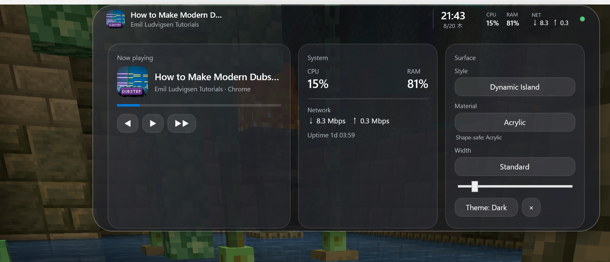
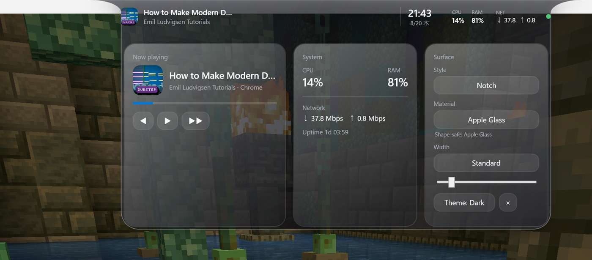
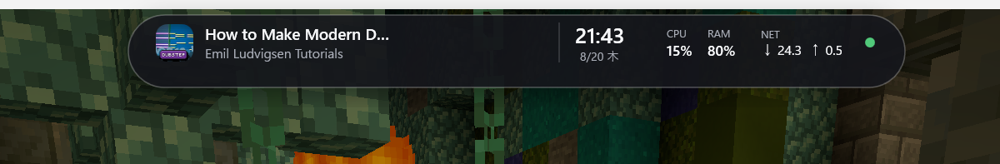

<p align="center">
  
</p>

<p align="center">
  日本語 · <a href="README.md">English</a>
</p>

<p align="center">
  
  
  
  
</p>

# TopIsland

TopIslandは、Windowsの画面上部に常駐して、メディア・システム情報・簡単な操作をまとめる**トップセンター型オーバーレイ**です。

浮いているDynamic Island風だけでなく、画面上端から直接生えるNotchにも切り替えられます。Notchの肩は単純な角丸ではなく、上端から凹方向へ滑らかにつながる逆R形状です。

<p align="center">
  
</p>

> 上の画像は実際のWPFアプリをMinecraft上で動かして撮影したものです。GitHubでUIが見やすいようにTopIsland周辺だけクロップしています。

## できること

- **Dynamic Island / Notch** をその場で切り替え
- **逆R付きNotch** — 上端から自然につながる凹形状
- **Idle → Hover → Peek → Expanded** の状態遷移
- **Material切替** — Solid / Mica / Acrylic / Apple Glass / Material Copy
- Windows GMTCから曲名・アーティスト・アートワーク・進捗を取得
- Previous / Play-Pause / Next のメディア操作
- CPU / RAM / Network / Uptime / 時計 / 日付
- TopIslandをクリックしても背後のゲームやアプリからフォーカスを奪わない
- 透明部分はOSレベルでクリック透過
- Authentic / Compact / Standard / Wide / Full Width / Custom の幅プリセット
- System / Light / Dark テーマ
- `%APPDATA%\TopIsland\settings.json` に設定保存

## Material

| Material | 見た目 |
| --- | --- |
| **Solid** | 一番コントラストが高い不透明サーフェス |
| **Mica** | 落ち着いた密度のWindows寄りサーフェス |
| **Acrylic** | より透け感の強いガラス寄りサーフェス |
| **Apple Glass** | ハイライトを強めた明るいガラス表現 |
| **Material Copy** | Windowsのアクセントカラーを薄く取り込む適応型サーフェス |

Windows 11にはDWMのNative Mica / Desktop Acrylicがありますが、TopIslandで必要な透明WPFホストにそのまま適用すると、Islandの外側にある影用の矩形領域まで灰色に描画されます。現在は形状を優先して、Native APIの対応可否を確認しつつ、実表示には**TopIsland側のshape-safe renderer**を使っています。

## Screenshots

<table>
  <tr>
    <td align="center"><b>Notch · Apple Glass</b></td>
    <td align="center"><b>Compact · Mica</b></td>
  </tr>
  <tr>
    <td></td>
    <td></td>
  </tr>
</table>

## 操作

- マウスを乗せる → 少し広がる
- そのままHover → Peekへ移行
- クリック → Expanded
- Expandedからマウスを外す → 少し待って収納
- Expanded内からStyle / Material / Width / Themeを変更

Hoverではサイズだけでなく影のBlur/Opacityも補間して、ただ拡大するのではなく少し「質量が出る」ようにしています。

## Build

必要なもの:

- Windows 10以上
- .NET 10 SDK

```powershell
dotnet build TopIsland.slnx -c Release
```

Windows x64向けPublish:

```powershell
dotnet publish TopIsland/TopIsland.csproj -c Release -r win-x64 --self-contained false -o artifacts/publish
```

## 現在の状態

まだ完成版ではなく、動くインタラクティブプロトタイプです。オーバーレイ本体、メディア連携、Material切替、設定保存、クリック透過、フォーカス維持、主要アニメーションは動作しています。今後はマルチモニター / Per-Monitor DPIと、矩形を出さずに使えるCompositionベースの本物のBlur経路を詰める予定です。
