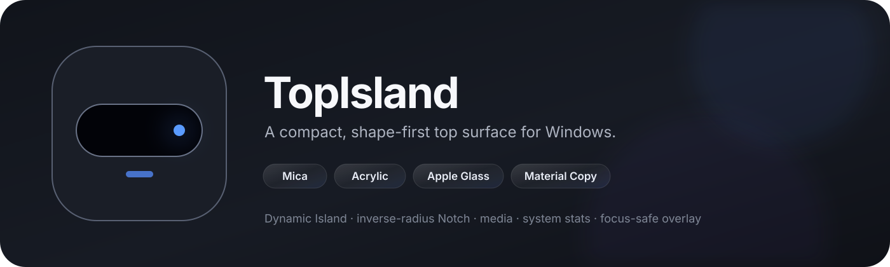
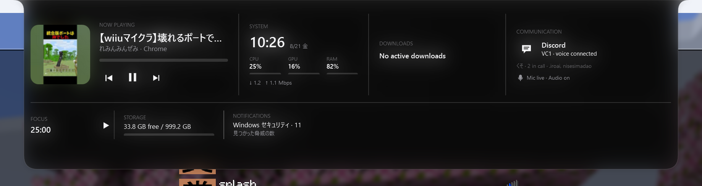
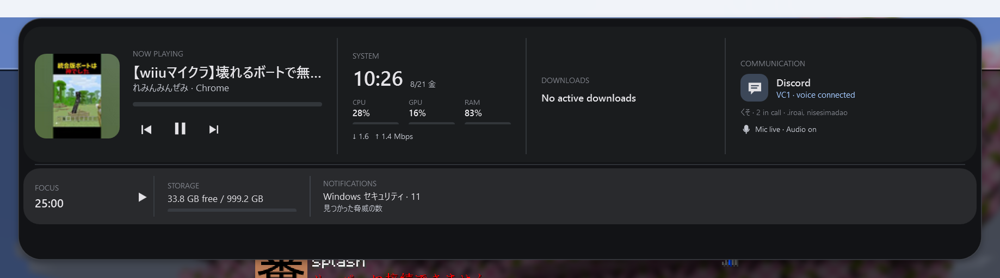

<p align="center">
  
</p>

<p align="center">
  日本語 · <a href="README.md">English</a>
</p>

<p align="center">
  
  
  
</p>

# TopIsland

TopIslandは、Windowsの画面上部中央に常駐し、必要なときだけ情報量を増やすトップサーフェスです。浮いた**Dynamic Island**と、画面上端から逆Rで生える**Notch**を切り替えられます。

基準デザインは、**1枚の面・実データ・必要な幅だけ情報量を増やす**ことを重視しています。角丸カードを大量に並べるダッシュボードにはしません。

<p align="center">
  
</p>

> 実際に動いているWPFアプリのスクリーンショットです。GitHub上でUIが見やすいよう、表示面の周辺をクロップしています。

## 実データ

現在は次の情報を実際のWindows/アプリから取得しています。

- Windows GMTCのメディア情報、アートワーク、再生位置、Previous / Play-Pause / Next
- メディアがない場合の前面アプリ名、プロセス、実行ファイルアイコン
- **CPU / GPU / RAM**
- **Discord VC** — Discord Desktopから現在のVC名、サーバー、参加人数/参加者、自分のMute/Deafen状態をWindows UI Automationで読み取ります
- NetworkのDownload / Upload速度
- システムドライブの空き容量 / 総容量
- `.crdownload` / `.part`など実際に進行しているDownloadと実測転送速度
- 25分 / 45分の**Focus Timer**、Pause / Resume / Reset
- 許可済みの場合のみWindows通知の件数、アプリ名、最新テキスト
- Battery搭載機のみ残量 / 充電状態
- 時刻 / 日付

Windows通知の権限は起動時に勝手に要求しません。許可がない場合は通知レーンを隠し、必要なときだけTrayの**Enable notifications**から要求できます。

## 表示状態

- **Idle** — 選択中の幅に必要な最小情報
- **Hover** — わずかに広く・深くなる
- **Peek** — Full Expandせず、優先度の低い情報を少し追加
- **Expanded** — **Now Playing / System / Downloads / Communication** の4領域と、Focus / Storage / Notifications / Batteryの下段レーン。角丸カードを大量に並べず、細いdividerで区切ります

幅が狭い場合は文字を無理に縮めず、優先度の低い項目を消します。Full WidthではNetwork / Storage / Activityなどを追加できますが、Media本文やProgressBarそのものを画面幅まで引き伸ばしません。

## Screenshots

<table>
  <tr>
    <td align="center"><b>Dynamic Island · Material You</b></td>
    <td align="center"><b>Notch · Glass / Live Blur</b></td>
  </tr>
  <tr>
    <td></td>
    <td></td>
  </tr>
</table>

## システムトレイ

TopIsland本体を設定画面化せず、Trayアイコンの右クリックから設定できます。

- Show / Hide
- Expand
- Dynamic Island / Notch
- Width: Authentic / Compact / Standard / Wide / Full Width
- Material / Theme
- Display: Follow active app / Primary / 固定モニター
- Focus timer: 25分 / 45分 / Pause-Resume / Reset
- 必要な場合のみEnable notifications
- Launch at startup
- Quit

設定は `%APPDATA%\TopIsland\settings.json` に保存されます。

## マルチモニター / DPI

WPF本体とBlurHostは**PerMonitorV2**です。モニターごとの物理解像度とWindowsのScale Factorを独立して扱います。

Displayは次から選べます。

- **Follow active app** — 前面アプリがあるモニターを追従
- **Primary display**
- **Fixed display** — 特定の接続モニターへ固定

別DPIのモニターへ移動するときは、無理に横スライドさせず短くFade Outし、移動先DPIで再計算してFade Inします。

開発機では3840×2160 @ 150%と2560×1440 @ 125%の組み合わせで確認しています。

## デザイン基準

設計監査は [`docs/DESIGN-AUDIT.md`](docs/DESIGN-AUDIT.md) に残しています。

主なルール:

- 主役のSurfaceは1枚
- `Solid`黒が基準デザイン
- 4 / 8 / 12 / 16 / 24 dipのspacing scale
- 形状上の理由がない限り左右余白は対称
- 絵文字UIではなくvector icon
- 狭い幅では文字を圧縮せず情報を減らす
- Notchの逆Rを横幅に合わせて引き伸ばさない
- Wide / Full WidthでもMedia本文やProgressBarを無意味に伸ばさない

現在のNotch形状:

| State | 上側の逆R | 下側R |
| --- | ---: | ---: |
| Closed | 6 | 14 |
| Expanded | 19 | 24 |

## Material / Live Blur

Notchの基準は`Solid`黒です。`Mica`は密度の高いオプションSurfaceです。`Acrylic` / `Glass`は、**実際の背景をshape内だけぼかすLive Blur**を使います。`Material You`は別系統で、Windowsのアクセント色をHCT seedにしてMaterial 3の`TonalSpot` schemeを生成し、`surface` / `surfaceContainerLow` / `surfaceContainerHigh` / `onSurface` / `outlineVariant` / `primary`などのsemantic roleを使います。Material YouではBlurHostを起動しません。

透明なWPF WindowへDWM backdropを直接適用すると、Notch/Island外側の矩形Window領域まで塗られてしまうため採用していません。代わりに別プロセスの**TopIsland.BlurHost**が、

1. TopIsland直下の小さな画面領域だけ取得
2. SkiaSharpでGaussian Blur
3. Dynamic Island / 逆R Notchと同じPathでper-pixel alpha clip
4. WPFの文字・操作UIの直下へ配置

という処理を行います。

これにより矩形の灰色Backdropを出さず、逆Rやクリック透過用余白を維持できます。通常サイズは約30fps、巨大なFull Widthでは更新頻度を少し下げています。開発機では代表的なStandard / Full Width状態でBlurHostは概ね**CPU約1%、Working Set 40〜50MB**でした。

BlurHostが見つからない/起動できない場合は、文字が読めなくならないよう従来の濃い非Blur Materialへ自動fallbackします。

## Build

必要なもの:

- Windows 10以上
- .NET 10 SDK

本体とBlurHostをBuild:

```powershell
dotnet build TopIsland.slnx -c Release
```

Windows x64向けに本体+BlurHostをまとめてPublish:

```powershell
powershell -ExecutionPolicy Bypass -File scripts/publish.ps1
```

出力例:

```text
artifacts/publish/
  TopIsland.exe
  ...
  BlurHost/
    TopIsland.BlurHost.exe
    SkiaSharp.dll
    libSkiaSharp.dll
    ...
```

現在ユーザー向けにローカルインストール:

```powershell
powershell -ExecutionPolicy Bypass -File scripts/install-local.ps1
```

アンインストール:

```powershell
powershell -ExecutionPolicy Bypass -File scripts/uninstall-local.ps1
```

インストール先は `%LOCALAPPDATA%\Programs\TopIsland`。Start Menu shortcutを作成します。Windows自動起動はデフォルトOFFで、勝手に有効化しません。

## 現在の状態

まだ完成版ではありませんが、Media/前面アプリ、CPU/GPU/RAM/Network/Storage、Focus/Download監視、許可済みWindows通知、Notch/Dynamic geometry、Hover/Peek/Expanded motion、クリック透過、フォーカス維持、Tray設定、設定保存、マルチモニター、PerMonitorV2、shape-clipped Live Blurまで動作しています。
