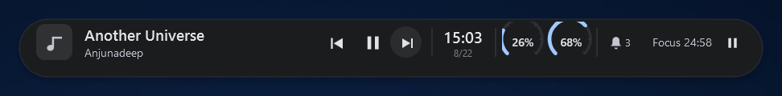
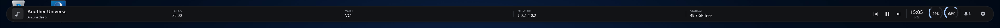

<p align="center">
  
</p>

<p align="center">
  <a href="README.ja.md">日本語</a> · English
</p>

<p align="center">
  
  
  
</p>

# TopIsland

TopIsland is a top-center Windows surface that stays small until you need more information. It can float as a **Dynamic Island** or attach to the top edge as an inverse-radius **Notch**.

The reference appearance is intentionally restrained: **one surface, real data, contextual density, and no nested dashboard of rounded cards**.

<p align="center">
  
</p>

> Real runtime capture from the WPF app. The screenshot is cropped to the rendered surface so the layout remains readable on GitHub.

## Live information

TopIsland currently uses real Windows/application data for:

- Windows GMTC media title, source, artwork, playback position, interactive seek and Previous / Play-Pause / Next
- Foreground application title, process and executable icon; Expanded also shows live foreground-process CPU, memory and process uptime in the SESSION lane when no download is active
- **CPU / GPU / RAM** usage
- Compact CPU/RAM use a tiny **open-right tachometer gauge** that stays inside the existing 43×34 footprint. The upper/left arc wraps the two text rows, so `CPU` / `RAM` and the percentage read as part of the gauge rather than as a separate text column; live samples use short ease-out interpolation instead of jumping between values
- **Discord VC** from the live Discord Desktop accessibility tree, including hidden/tray-minimized Electron windows, channel/server, participant count, Mute/Deafen state and real Mute / Deafen / Leave controls when Discord exposes those UIA patterns
- Default Windows audio output and master volume in Expanded when Discord voice is not occupying that Overview slot
- Network download/upload throughput
- System-drive free/total storage
- Active browser/download-manager partial downloads, including current bytes and measured transfer speed when available
- Built-in **Focus timer** with 25/45-minute presets, pause/resume, reset and an Expanded progress indicator while active
- Windows notifications: count, source app, app logo when Windows exposes it (initial badge fallback), latest text when notification-listener access is allowed, plus a real Clear all action
- Battery level/charging state on devices that actually have a battery
- Clock and date

Notification permission is never requested automatically. If access is not already allowed, the notification lane stays hidden and the tray can expose **Enable notifications**.

## Interaction states

- **Idle** — media/app context, clock, open-right tachometer-style usage gauges labeled **CPU / RAM**, plus compact activity indicators when the selected width allows them
- **Hover** — subtly wider/deeper
- **Reveal on top edge** — optional mode that hides the idle surface and keeps the hidden region click-through. For Notch, reaching the top-center edge grows the surface downward from the physical screen boundary: the inverse-R shoulders stay anchored at the top edge and increase their radius as the body emerges, rather than fading in
- Hover gives a running Focus timer its own remaining-time + real Pause/Resume control before lower-priority activity text
- **Peek** — reveals selected lower-priority information without opening the full surface
- **Expanded** — Context/Now Playing, a large clock-centered Overview with CPU/GPU/RAM, Power/Thermal and Discord voice controls (or Output/Volume when not in voice), plus Notifications when present. The lower row is Timers, SESSION (foreground process telemetry) or active Downloads, and Storage / Network / Hardware/Uptime

Smaller widths remove information instead of shrinking every label. When no download is moving, the lower middle lane shows the foreground **SESSION** (process, memory, CPU, threads and uptime); an actively changing partial download replaces that lane instead of creating another permanent card. Discord controls appear only while voice is connected, and Notifications collapse when unavailable. Full Width uses the otherwise empty center for Focus / Voice / active Downloads / Network / Storage instead of stretching artwork or text. Its right-edge settings gear opens the same real TopIsland context menu used by the tray/overlay. The Expanded clock remains the visual anchor above the two-row information layout.

## Screenshots

<table>
  <tr>
    <td align="center"><b>Compact Notch Idle · labeled CPU/RAM</b></td>
    <td align="center"><b>Hover · active Focus control</b></td>
  </tr>
  <tr>
    <td></td>
    <td></td>
  </tr>
</table>
<table>
  <tr>
    <td align="center"><b>Dynamic Island · Material You</b></td>
    <td align="center"><b>Notch · Glass / Live Blur</b></td>
  </tr>
  <tr>
    <td></td>
    <td></td>
  </tr>
</table>

<p align="center">
  <b>Full Width · Material You</b><br>
  
</p>

> Repository screenshots are real runtime captures. Privacy-sensitive notification/voice labels are pixelated before commit.

## System tray

Right-click the TopIsland tray icon to configure the app without turning the overlay into a settings dashboard:

- Show / Hide
- Expand
- Dynamic Island / Notch
- Reveal on top edge
- Width: Authentic / Compact / Standard / Wide / Full Width
- Material and theme
- Display: Follow active app / Primary / a fixed connected display
- Focus timer: 25 min / 45 min / Pause-Resume / Reset
- Enable notifications when Windows access is not already allowed
- Launch at startup
- Quit

All persistent choices use the same `%APPDATA%\TopIsland\settings.json` model.

## Multiple displays and DPI

The WPF host and the blur helper are **PerMonitorV2**. TopIsland reads each monitor's physical display mode and Windows scale factor independently.

Current display modes:

- **Follow active app** — follow the monitor containing the foreground window
- **Primary display**
- **Fixed display** — pin TopIsland to a selected connected monitor

A follow transition fades out briefly, moves/recalculates for the destination DPI, then fades back in instead of sliding through unrelated monitor coordinate spaces.

The current development machine verifies a 2560×1440 display at 150% and a 2048×1152 display at 125%.

## Design baseline

TopIsland deliberately avoids the common glass-card dashboard look. The current visual audit is documented in [`docs/DESIGN-AUDIT.md`](docs/DESIGN-AUDIT.md).

Key rules:

- One primary surface
- Black `Solid` is the reference appearance
- 4 / 8 / 12 / 16 / 24 dip spacing scale
- Symmetric edge clearances unless geometry requires otherwise
- Vector icons, never emoji UI glyphs
- Compact widths hide lower-priority data instead of compressing typography
- Notch inverse radii stay independent of width
- Wide shells do not stretch progress bars/media content merely to fill space

The Notch geometry currently uses:

| State | Inverse top radius | Bottom radius |
| --- | ---: | ---: |
| Closed | 6 | 14 |
| Expanded | 19 | 24 |

## Materials and live blur

`Solid` black remains the default, especially for Notch. `Mica` is the denser optional surface. `Acrylic` and `Glass` use a **real shape-clipped live background blur**. `Material You` is a separate Material 3 theme: the Windows accent becomes an HCT seed, `TonalSpot` generates the M3 semantic color roles, and the surface uses `surface` / `surfaceContainerLow` / `surfaceContainerHigh`, `onSurface`, `outlineVariant`, Primary and M3 state-layer colors. It does not use glass blur.

TopIsland intentionally does not apply the native DWM backdrop directly to the transparent WPF window because DWM paints the rectangular host bounds around custom Notch/Island geometry. Instead, a small companion process named **TopIsland.BlurHost**:

1. captures only the TopIsland screen rectangle behind the layered overlay,
2. applies a Gaussian blur with SkiaSharp,
3. clips the result to the exact Dynamic Island or inverse-radius Notch path with per-pixel alpha,
4. places that blur surface directly below the WPF text/controls.

This keeps the real geometry and click-through padding intact without a gray rectangle around it. The helper stays responsive while the shell is moving, then reduces its refresh rate after the geometry settles. It also reuses Skia objects and blurs a half-resolution working surface before compositing at full resolution. On the current development PC, representative Glass Expanded measurements are roughly **1.8% normalized CPU / 55–60 MB working set** at Standard width and about **2.8% CPU** at Full Width. These are prototype measurements, not a hardware-independent target.

If BlurHost is unavailable, TopIsland automatically falls back to the denser non-blurred material tint instead of leaving the surface unreadable.

## Build

Requirements:

- Windows 10 or newer
- .NET 10 SDK

Build both projects:

```powershell
dotnet build TopIsland.slnx -c Release
```

Publish the complete Windows x64 layout, including BlurHost:

```powershell
powershell -ExecutionPolicy Bypass -File scripts/publish.ps1
```

The resulting layout is:

```text
artifacts/publish/
  TopIsland.exe
  ...
  BlurHost/
    TopIsland.BlurHost.exe
    SkiaSharp.dll
    libSkiaSharp.dll
    ...
```

Install the published build for the current user:

```powershell
powershell -ExecutionPolicy Bypass -File scripts/install-local.ps1
```

Uninstall:

```powershell
powershell -ExecutionPolicy Bypass -File scripts/uninstall-local.ps1
```

Local installation uses `%LOCALAPPDATA%\Programs\TopIsland` and creates a Start Menu shortcut. Launch-at-startup remains opt-in.

## Status

TopIsland is still an interactive prototype, but its core overlay is functional: media/foreground context, the contextual Expanded layout, hidden-window Discord voice-state/control integration, focus/download monitoring, Windows notification reading when permitted, geometry/motion, click-through and no-activate behavior, system-tray configuration, persistence, multi-display placement, PerMonitorV2 scaling, Material You dynamic color, and shape-clipped live blur materials are working.
