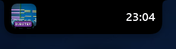

<p align="center">
  
</p>

<p align="center">
  <a href="README.ja.md">日本語</a> · English
</p>

<p align="center">
  
  
  
</p>

# TopIsland

TopIsland is a top-center Windows surface that stays small until you need more information. It can float as a **Dynamic Island** or attach to the top edge as an inverse-radius **Notch**.

The reference appearance is intentionally restrained: **one black surface, real data, contextual density, and no nested dashboard of rounded cards**.

<p align="center">
  
</p>

> Real runtime capture from the WPF app. The screenshot is cropped to the rendered surface so the layout remains readable on GitHub.

## Live information

TopIsland currently uses real Windows/application data for:

- Windows GMTC media title, source, artwork, playback position and Previous / Play-Pause / Next
- Foreground application title, process and executable icon when there is no active media session
- **CPU / GPU / RAM** usage
- Network download/upload throughput
- System-drive free/total storage
- Active browser/download-manager partial downloads, including current bytes and measured transfer speed when available
- Built-in **Focus timer** with 25/45-minute presets, pause/resume and reset
- Windows notifications: count, source app and latest text when notification-listener access is allowed
- Battery level/charging state on devices that actually have a battery
- Clock and date

Notification permission is never requested automatically. If access is not already allowed, the notification lane stays hidden and the tray can expose **Enable notifications**.

## Interaction states

- **Idle** — minimum information for the selected width
- **Hover** — subtly wider/deeper
- **Peek** — reveals selected lower-priority information without opening the full surface
- **Expanded** — media/context row plus one lower information lane separated only by hairline dividers

Smaller widths remove information instead of shrinking every label. Full Width is allowed to reveal extra network/storage/activity status, but the media content itself still has a readable maximum width.

## Screenshots

<table>
  <tr>
    <td align="center"><b>Dynamic Island · Expanded</b></td>
    <td align="center"><b>Notch · Authentic</b></td>
  </tr>
  <tr>
    <td></td>
    <td></td>
  </tr>
</table>

## System tray

Right-click the TopIsland tray icon to configure the app without turning the overlay into a settings dashboard:

- Show / Hide
- Expand
- Dynamic Island / Notch
- Width: Authentic / Compact / Standard / Wide / Full Width
- Material and theme
- Display: Follow active app / Primary / a fixed connected display
- Focus timer: 25 min / 45 min / Pause-Resume / Reset
- Enable notifications when Windows access is not already allowed
- Launch at startup
- Quit

All persistent choices use the same `%APPDATA%\TopIsland\settings.json` model.

## Multiple displays and DPI

The WPF host is **PerMonitorV2**. TopIsland reads each monitor's physical display mode and Windows scale factor independently.

Current display modes:

- **Follow active app** — follow the monitor containing the foreground window
- **Primary display**
- **Fixed display** — pin TopIsland to a selected connected monitor

A follow transition fades out briefly, moves/recalculates for the destination DPI, then fades back in instead of sliding through unrelated monitor coordinate spaces.

The current development machine verifies a 3840×2160 display at 150% and a 2560×1440 display at 125%.

## Design baseline

TopIsland deliberately avoids the common glass-card dashboard look. The current visual audit is documented in [`docs/DESIGN-AUDIT.md`](docs/DESIGN-AUDIT.md).

Key rules:

- One primary surface
- Black `Solid` is the reference appearance
- 4 / 8 / 12 / 16 / 24 dip spacing scale
- Symmetric edge clearances unless geometry requires otherwise
- Vector icons, never emoji UI glyphs
- Compact widths hide lower-priority data instead of compressing typography
- Notch inverse radii stay independent of width
- Wide shells do not stretch progress bars/media content merely to fill space

The Notch geometry currently uses:

| State | Inverse top radius | Bottom radius |
| --- | ---: | ---: |
| Closed | 6 | 14 |
| Expanded | 19 | 24 |

## Materials

`Solid` black is the default. Mica / Acrylic / Glass / Material Copy remain optional appearances.

Native DWM backdrop APIs were tested, but on the transparent shaped WPF host they paint rectangular window bounds around the custom geometry. The stable path therefore keeps the real Notch/Island shape intact. A compositor-backed shaped blur remains an isolated experiment rather than a dependency of the working overlay.

## Build

Requirements:

- Windows 10 or newer
- .NET 10 SDK

```powershell
dotnet build TopIsland.slnx -c Release
```

Publish Windows x64:

```powershell
dotnet publish TopIsland/TopIsland.csproj -c Release -r win-x64 --self-contained false -o artifacts/publish
```

Install the published build for the current user:

```powershell
powershell -ExecutionPolicy Bypass -File scripts/install-local.ps1
```

Uninstall:

```powershell
powershell -ExecutionPolicy Bypass -File scripts/uninstall-local.ps1
```

Local installation uses `%LOCALAPPDATA%\Programs\TopIsland` and creates a Start Menu shortcut. Launch-at-startup remains opt-in.

## Status

TopIsland is still an interactive prototype, but its core overlay is functional: media/foreground context, richer live information, focus/download monitoring, Windows notification reading when permitted, geometry/motion, click-through and no-activate behavior, system-tray configuration, persistence, multi-display placement and PerMonitorV2 scaling are working.
